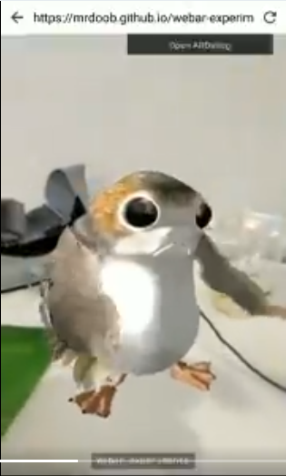
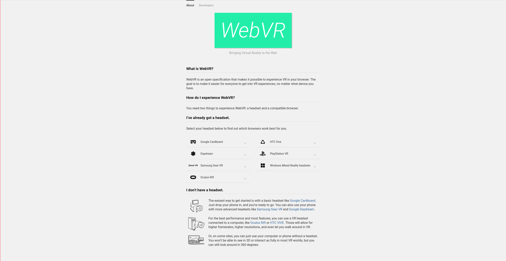
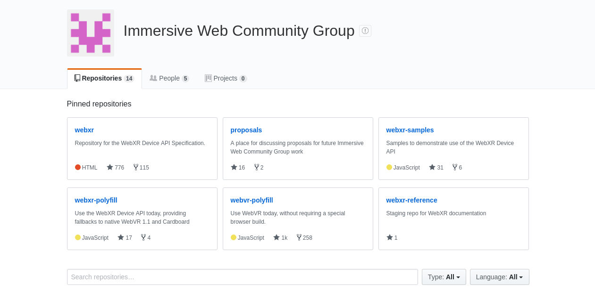
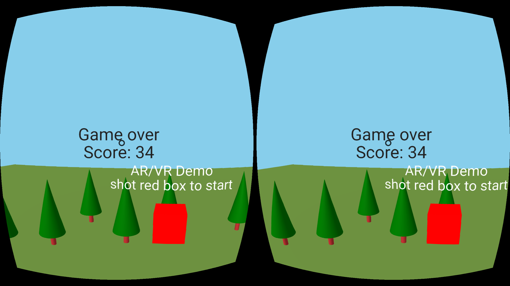
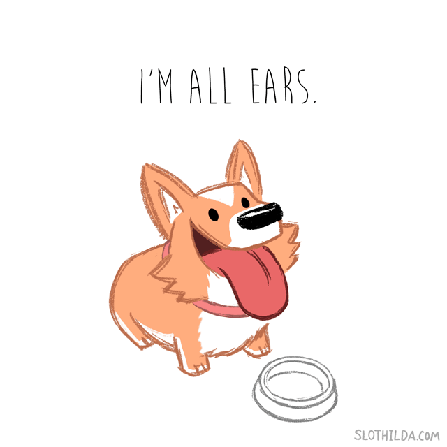

# A-Frame
## Create VR experiences in your browser. Easily.

_by [@anxolerd](https://github.com/anxolerd)_

-----

## Browsers become tiny operating systems

- [Geolocation API](https://www.w3.org/TR/geolocation-API/)
- [Gyroscope API](https://www.w3.org/TR/2018/CR-gyroscope-20180320/)
- [Generic Sensor API](https://www.w3.org/TR/2018/CR-generic-sensor-20180320/)
- [Web Authn API](https://www.w3.org/TR/2018/CR-webauthn-20180320/)
- [Web Speech API](https://w3c.github.io/speech-api/webspeechapi.html)
- [Web USB](https://wicg.github.io/webusb/)
- and [lots of other](https://www.w3.org/)

>>>>>

## AR/VR is not an exception

[](https://twitter.com/mrdoob/status/959598778662531072)

>>>>>

## Web VR

[](https://webvr.info)

>>>>>

## Web XR

[](https://github.com/immersive-web/)

-----

## [A-Frame](https://aframe.io)

[](https://aframe.io)

>>>>>

## A-Frame

<ul>
  <li class="fragment">Declarative</li>
  <li class="fragment">Easy-to-learn</li>
  <li class="fragment">Webcomponents</li>
  <li class="fragment">Framework-agnostic</li>
  <li class="fragment">Community</li>
</ul>

>>>>>

## A-Frame
### Relies on experimental technology

-----

## [Live coding](https://glitch.com/~dust-chanter)

> What can possibly go wrong?

>>>>>

### Connect library

    <script src="https://aframe.io/releases/0.8.0/aframe.min.js"></script>

>>>>>

### Create a scene

```html
<body>
    <a-scene></a-scene>
</body>
```

>>>>>

### Add objects

```html
<a-box color="white" rotation="0 45 0" position="0 0.5 0"></a-box>
<a-cylinder radius="0.2" height="1.5" 
            color="brown" position="0 0.75 0">
</a-cylinder>
```

>>>>>

### Animations

```html
<a-torus color="gold" position="0 2.4 0">
  <a-animation attribute="rotation"
               from="0 0 0"
               to="0 360 0"
               dur="5000"
               repeat="indefinite"
               easing="linear">
  </a-animation>
</a-torus>
```

>>>>>

### Import external objects

```html
<a-assets>
    <a-asset-item id="model" src="model.obj"></a-asset-item>
    <a-asset-item id="material" src="material.mtl"></a-asset-item>
</a-assets>

<a-entity obj-model="obj: #model; mtl: #material"></a-entity>
```

-----

## You can even build a game!

[](https://glitch.com/~shoot-those-boxes)

-----

## Thanks. Questions?



